####  Otel Rezervation System

####Description
 
<h6>Vue3</h6>
<h6>VueRouter</h6>
<h6>Vuex</h6>

####Install

`$ npm install`

`$ npm run serve`

####Run

`<link>` : <http://localhost:8080>

#### Any Question

 
mustafa05deniz@gmail.com
> > Main.
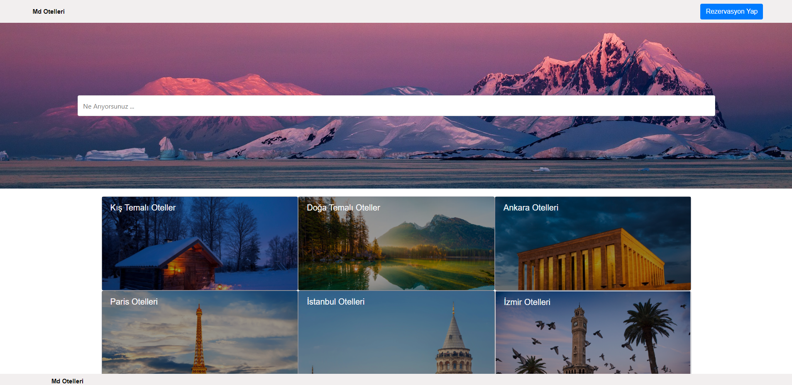 
> Mobile Ad.
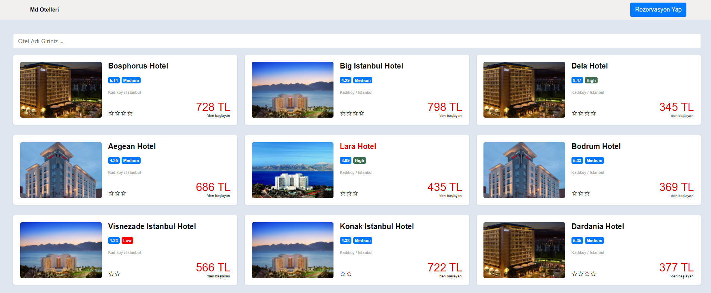 
> > Mobile Otels.
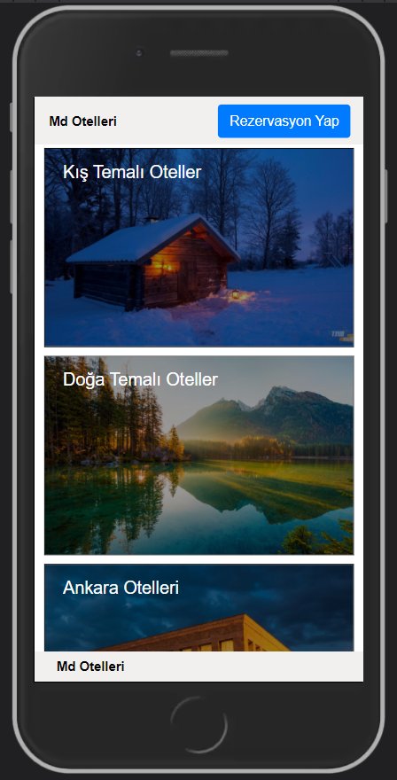 
> > Mobile Select.
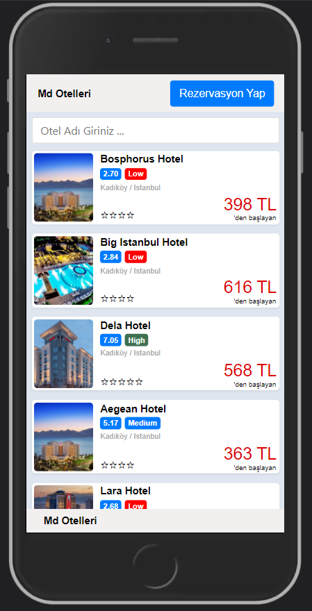 
> > Mobile Select.
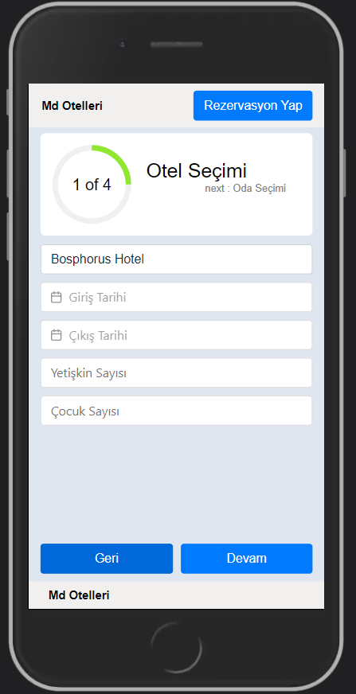 
> > Mobile Select.
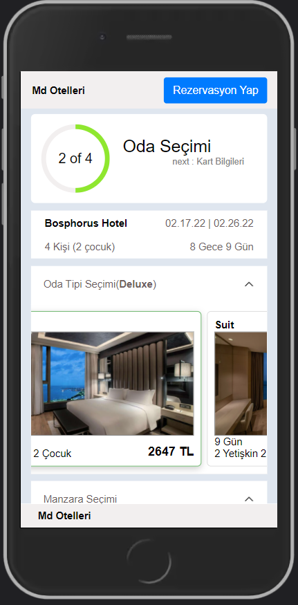 
> > Mobile Select.
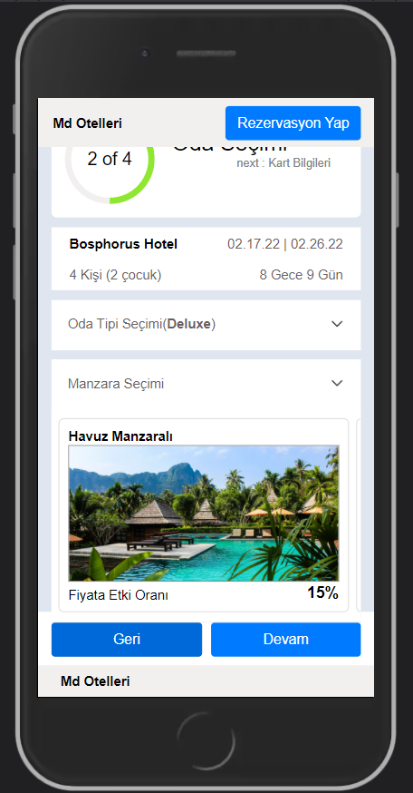 
> > Mobile Card.
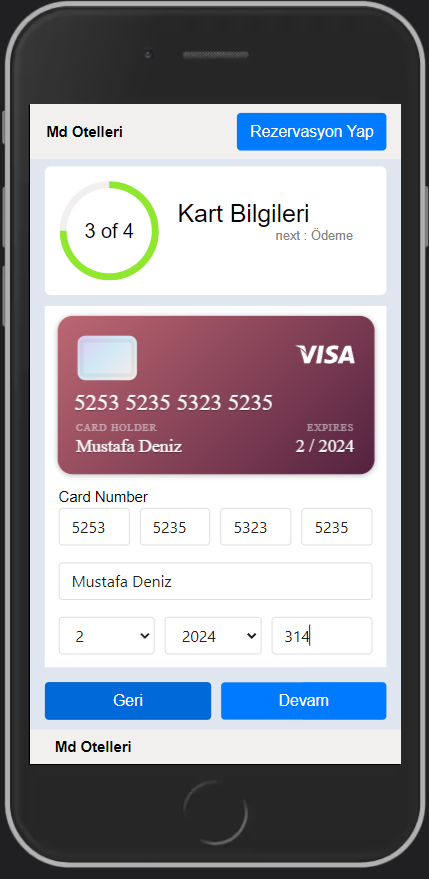 
> > Mobile Select.
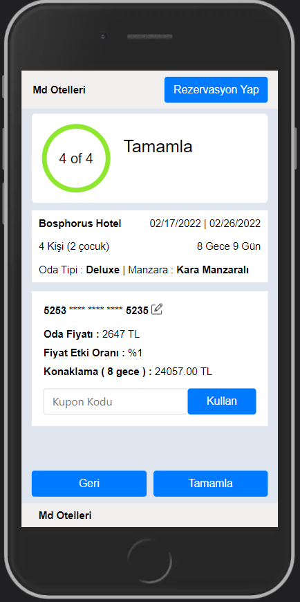 
> > Mobile Select.
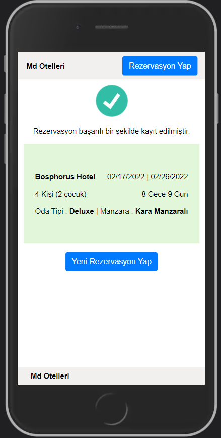 
> > Web Select.
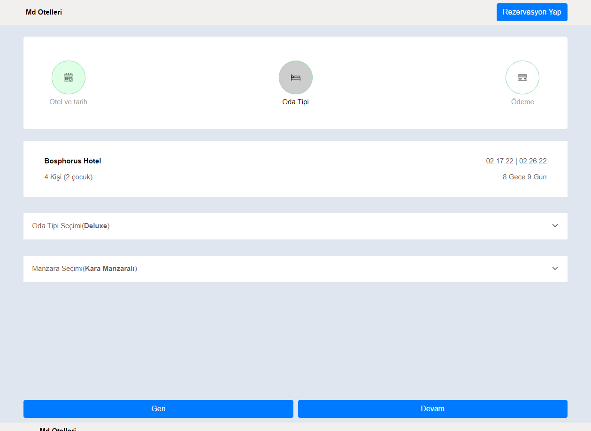 
> > Web Select.
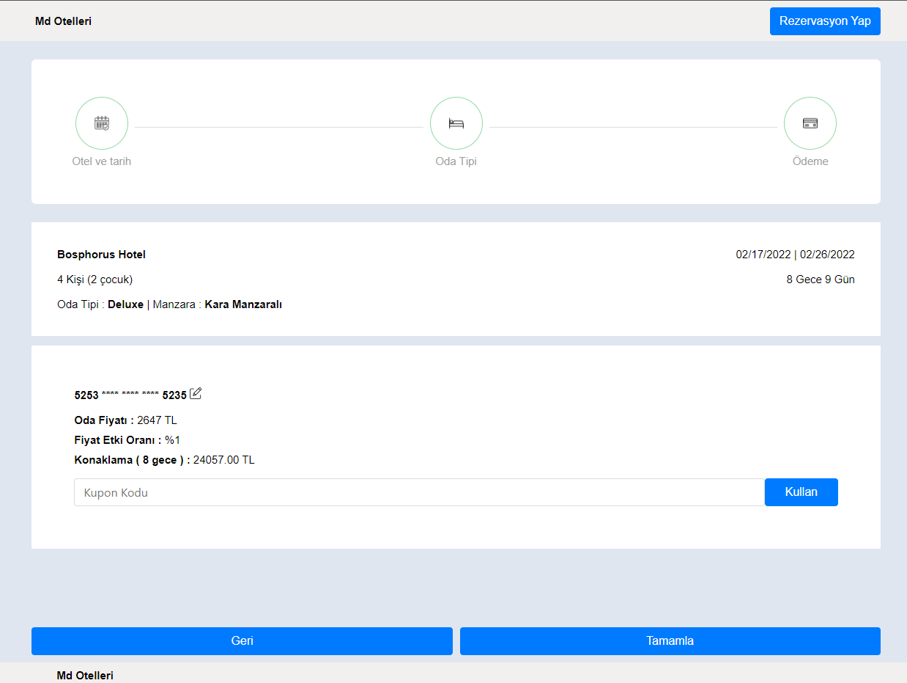 
